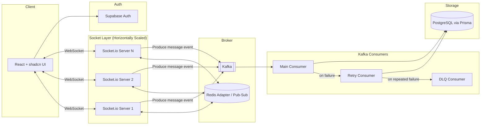

# WhatsYapp 💬

A highly scalable, real-time chat application built with a distributed, event-driven backend architecture designed to handle high-throughput messaging at scale.

---

## ✨ Features

- Real-time one-to-one and group messaging
- Horizontally scalable WebSocket layer (add socket servers without losing message delivery)
- High-throughput, non-blocking database writes via an event streaming pipeline
- Fault-tolerant message processing with automatic retries and dead-letter handling
- Secure authentication and session management
- Clean, modern UI built with shadcn/ui

---

## 🏗️ Architecture

WhatsYapp is built to scale horizontally at every layer — the socket servers, the message pipeline, and the database writes are all decoupled from each other.

### How it scales

**Socket layer — Redis Adapter**
Each Socket.io server instance is stateless with respect to other instances. Redis is used as the Socket.io adapter's pub/sub backbone, so an event emitted from one server instance is broadcast to clients connected on any other instance. This allows the socket layer to be scaled horizontally behind a load balancer without message loss or the need for sticky routing beyond the initial handshake.

**Write path — Kafka + Main → Retry → DLQ pattern**
Instead of writing every incoming message directly to Postgres (which would create write contention under high load), socket servers produce message events to Kafka. This decouples ingestion from persistence and smooths out traffic spikes.

Consumers process these events using a three-stage resilience pattern:

| Stage              | Responsibility                                                                                                                                                                              |
| ------------------ | ------------------------------------------------------------------------------------------------------------------------------------------------------------------------------------------- |
| **Main Consumer**  | Consumes new message events and attempts to persist them to the database.                                                                                                                   |
| **Retry Consumer** | Consumes events that failed on the main topic, applying backoff before reattempting the write.                                                                                              |
| **DLQ Consumer**   | Events that continue to fail after retries are routed to a Dead Letter Queue for inspection, alerting, or manual reprocessing — preventing poison-pill messages from blocking the pipeline. |

This ensures transient failures (e.g. a momentary DB connection issue) don't result in dropped messages, while permanently malformed events don't stall the consumer group.

---

## 🛠️ Tech Stack

### Backend

| Technology        | Purpose                                                      |
| ----------------- | ------------------------------------------------------------ |
| **Express**       | HTTP server / REST API                                       |
| **Socket.io**     | Real-time bidirectional communication                        |
| **Redis**         | Socket.io adapter for horizontal scaling of the socket layer |
| **Kafka**         | Event streaming for decoupled, high-throughput DB writes     |
| **PostgreSQL**    | Primary data store                                           |
| **Prisma**        | Type-safe ORM / database access layer                        |
| **Supabase Auth** | Authentication and user session management                   |

### Frontend

| Technology           | Purpose                                  |
| -------------------- | ---------------------------------------- |
| **React**            | UI library                               |
| **shadcn/ui**        | Component library                        |
| **Socket.io Client** | Real-time communication with the backend |

---
